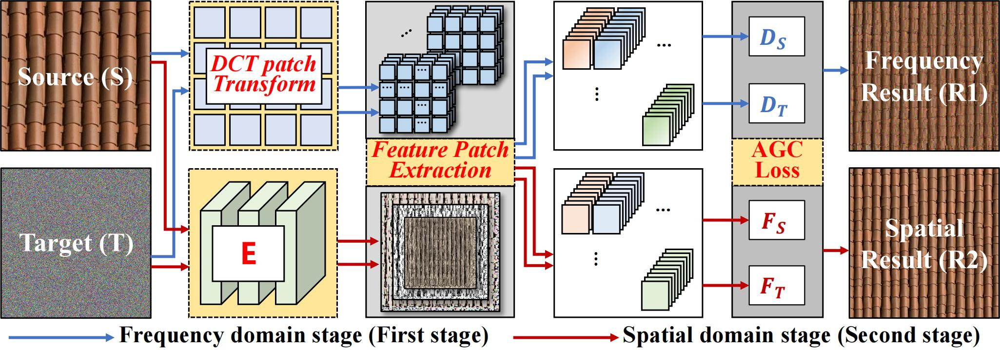
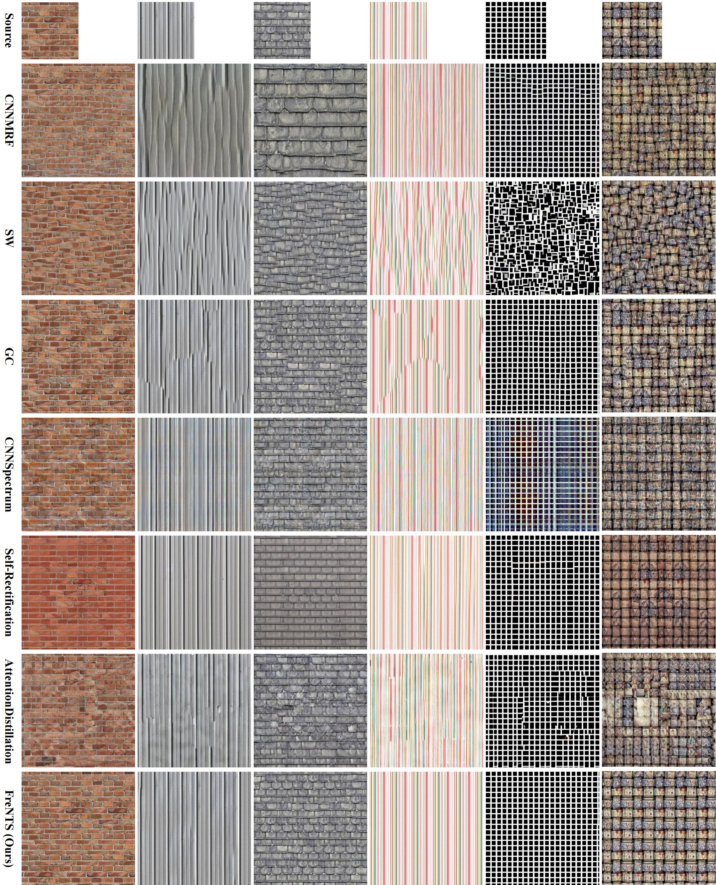
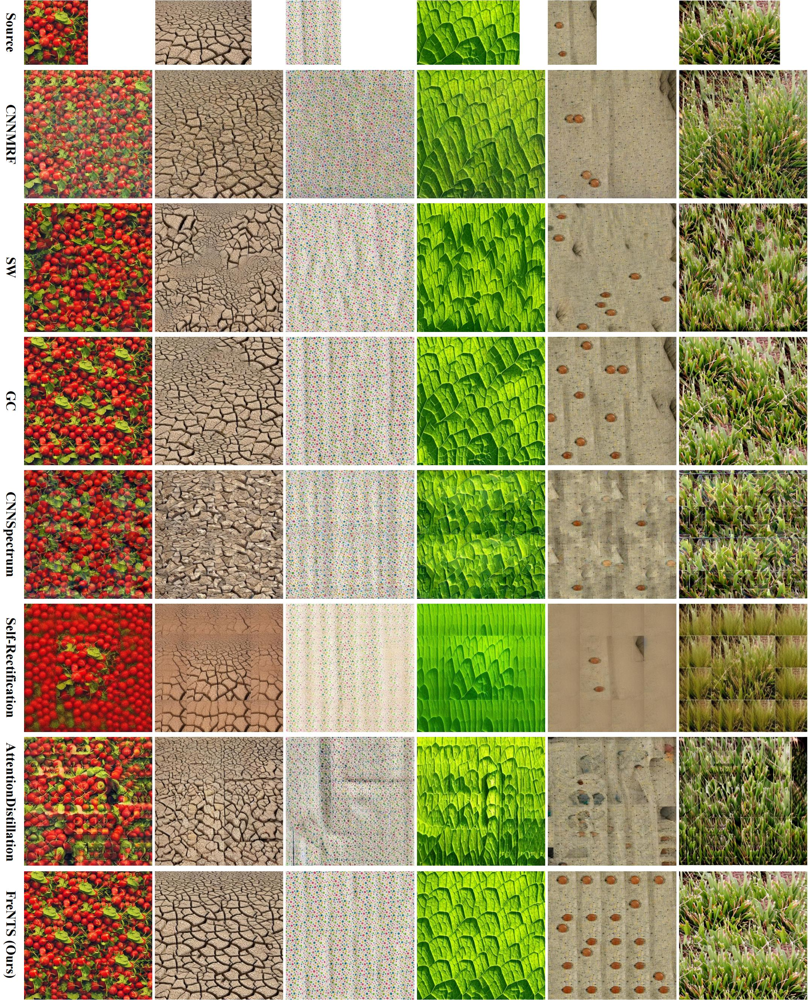

# FreNTS: Neural Texture Synthesis in Frequency Domain

[](https://opensource.org/licenses/MIT)

This repository contains the official PyTorch implementation of the paper **"FreNTS: Neural Texture Synthesis in Frequency Domain"** (IEEE TVCG).

## 📝 Update
- **[Feb 2026]** Our paper has been accepted by *IEEE Transactions on Visualization and Computer Graphics (TVCG)*. Code is now released!

## 🧠 Overview

Our method introduces a novel dual-domain framework that deeply integrates frequency domain information into the neural texture synthesis process. By utilizing the Discrete Cosine Transform (DCT), FreNTS ensures both global structural alignment in the frequency domain and local detail refinement in the spatial domain.

<p align="center">
  
</p>
<p align="center">
  <em>Figure 1: The overall architecture and pipeline of FreNTS.</em>
</p>

## 📊 Qualitative Results

FreNTS significantly outperforms existing methods in maintaining structural continuity and visual realism, particularly when synthesizing large-scale textures.

### 1. Structurally Regular Textures
Our method effectively preserves the dense connections and regular patterns without introducing structural fractures or visual artifacts.

<p align="center">
  
</p>

### 2. Structurally Irregular Textures
FreNTS also maintains highly competitive performance on irregular textures, producing visually rich and realistic variations.

<p align="center">
  
</p>

## ⚙️ Dependencies and Installation

The code has been tested with Python 3 and PyTorch. Built-in modules like `os`, `sys`, and `argparse` are used, alongside several external packages. 

To set up the environment, we recommend using a virtual environment (e.g., Conda) and installing the dependencies via the provided `requirements.txt`:

```bash
# Clone the repository
git clone git@github.com:yueyisui/FreNTS.git
cd FreNTS

# Install required packages
pip install -r requirements.txt
```

## 🚀 Usage

We provide scripts for both single-image texture synthesis and batch processing.

### Single Image Synthesis
To synthesize a texture from a single reference image, use `main.py`. The most important arguments are `--image_path` (source image) and `--output_folder` (where results are saved).

```bash
python main.py \
    --image_path data/source/test01.png \
    --output_folder ./outputs/texture_synthesis
```

**Advanced Configuration:**
You can further control the synthesis process using the following hyper-parameters (default values are optimized for standard use):
- `--output_size`: Dimensions of the synthesized texture (default: `512 512`).
- `--base_iters` / `--finetune_iters`: Number of iterations for the base synthesis and fine-tuning stages (default: `100` each).
- `--use_DCT`: Flag to activate the Discrete Cosine Transform (DCT) for frequency domain processing.
- `--lr`: Learning rate (default: `0.01`).
- `--lambda_occ`: Weight for the occurrence penalty (default: `0.05`).

### Batch Processing
To process multiple images automatically within a specific directory, use `main_auto.py`. You only need to specify the input directory and the output folder:

```bash
python main_auto.py \
    --input_dir data/images_compared_1 \
    --output_folder ./outputs/texture_synthesis
```

## 🎓 Citation

If you find our code or paper useful for your research, please consider citing our work:

```bibtex
@article{yue2026frents,
  title={FreNTS: Neural Texture Synthesis in Frequency Domain},
  author={Yue, Dongdong and Liu, Xinyi and Zhang, Yongjun and Zhang, Jinming and others},
  journal={IEEE Transactions on Visualization and Computer Graphics},
  year={2026}
}
```

## 🙏 Acknowledgments

This code is built upon the excellent work of **Neural Texture Synthesis With Guided Correspondence**. We express our gratitude to the authors for their open-source contributions.
